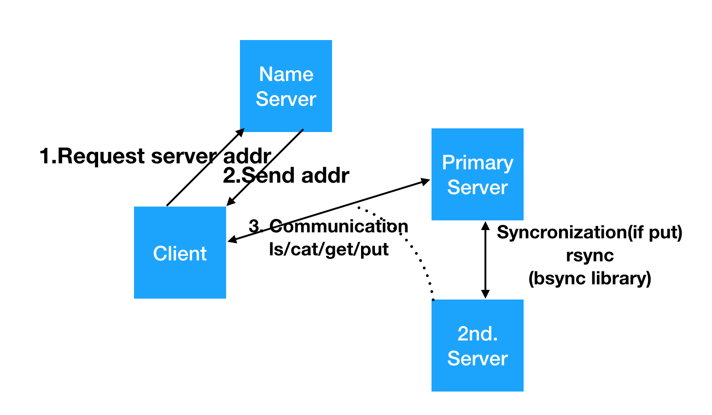
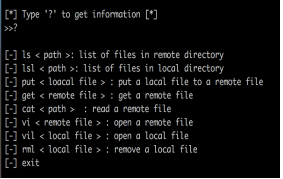

# mfdfs
* This is my project in the distributed file system courese.

* Enviroments
    * Language : python3
    * Primary Server: Multithread + rsync + raw socket 
    * Secondary Server: Multithread + rsync + raw socket 
    * Name Server: Redis + raw socket
    * Client : raw socket

* Arichitecutre  
  

* Command  
  
