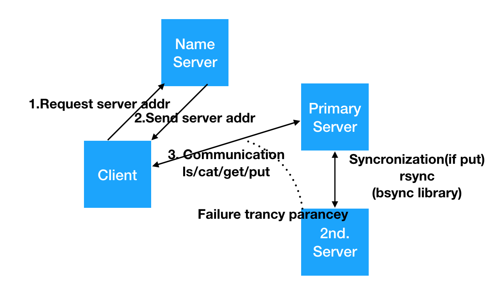

# mfdfs
* My first distributed file system

* Enviroments
- Language : python3 
- Primary Server: Multithread + rsync + raw socket 
- Secondary Server: Multithread + rsync + raw socket 
- Name Server: Redis + raw socket
- Client : raw socket

